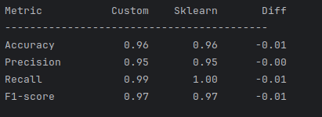

# Decision Tree Assignment

## Implementation

1. Node class that represents a decision node in the tree.
2. Each node stores a feature used for splitting, the threshold value for splitting, a reference to the left and right child nodes, and a label for leaf nodes.
3. DecisionTree class with fit(X,y), _grow_tree, best split, entropy and predict.
4. Pre pruning and post pruning
5. Load the breast cancer data set with preprocessing and split into training and test sets.
6. Model trained using the training set.
7. Pruning technique applied. 
8. Added evaluation using accuracy, precision, recall and F1-score. 
9. Compared the custom decision tree's performance to the sklearn.tree.DecisionTreeClassifier

## Compare the decision tree's performance with sklearn.tree.DecisionTreeClassifier

The accuracy differs by 0.01. The precision differs by 0.00. The recall differs by 0.01. The F1 score differs by 0.01. The data generated by both implementations are almost identical. 

## Pruning techniques

Pruning techniques can help overfitting and underfitting. They are basically a version of preprocessing and post-processing. It works to prevent data from influencing the final product that is not valid. 

## Posible improvements
Some improvements we can make are to extend the pre-pruning and post-pruning activities. We can use built in methods that are built into scikit-learn. 